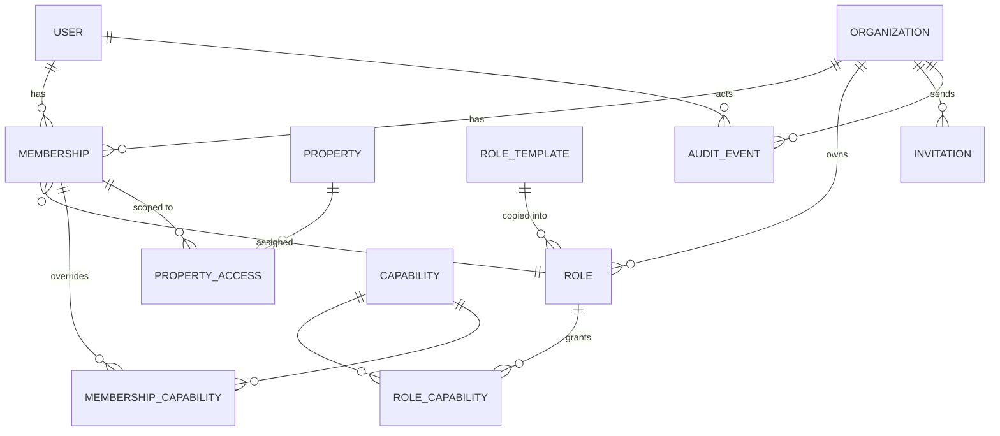
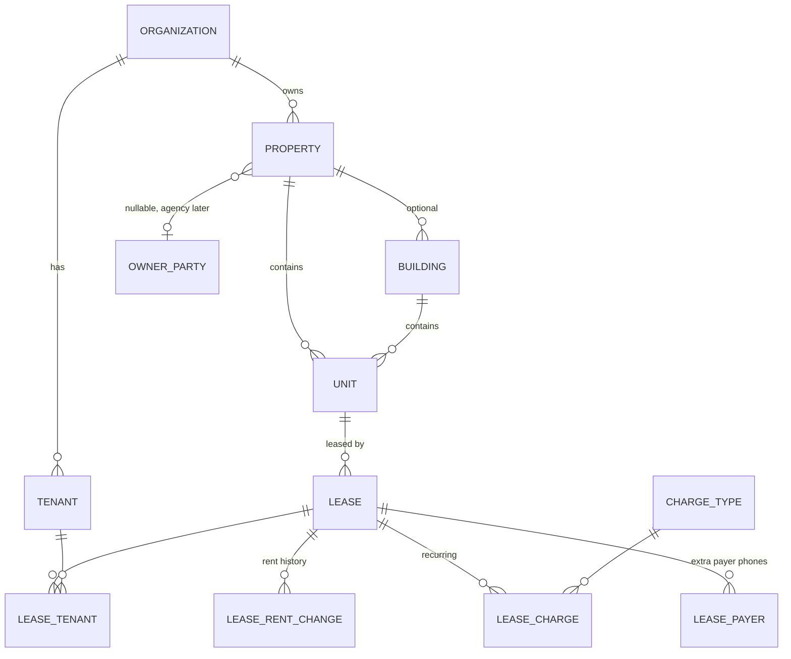
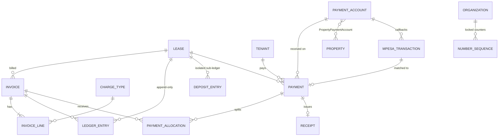
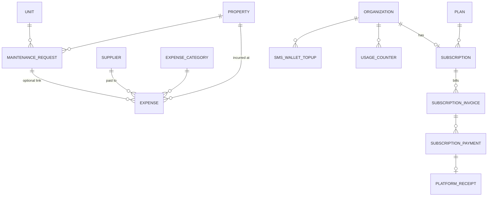
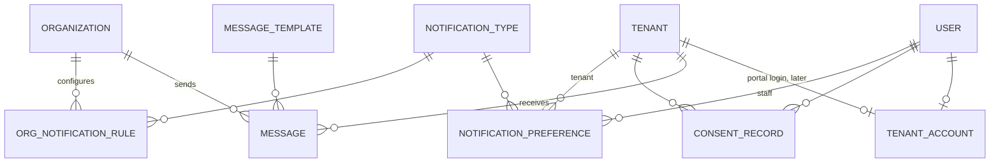

# Entity Relationship Diagram (draft for review)

Derived from doc 11 §2 and §22–27, doc 13 and doc 14. Not code. Every business table also carries `organization_id`, `created_at`, `updated_at`, and archivable tables carry `archived_at/by` (doc 11 §23). Money is `Decimal(14,2)` (doc 11 §25). View with any Mermaid renderer (VS Code Markdown Preview Mermaid extension, GitHub).

## 1. Identity, organizations, roles

## 2. Properties, tenants, leases

## 3. Billing, payments, M-Pesa, deposits (flow B)

## 4. Expenses (flow C), platform billing (flow A)

Flows A, B and C share no tables (doc 11 §22).

## 5. Communications and notification preferences

## Points to check in review
1. Is `TENANT_ACCOUNT` the right way to give tenants a portal login without making them staff?
2. `LEDGER_ENTRY` (rent) and `DEPOSIT_ENTRY` (deposits) are separate tables on purpose. Confirm.
3. `MPESA_TRANSACTION` to `PAYMENT` is one-to-one, so an unmatched transaction has no payment yet.
4. One payment may be split across several invoices (`PAYMENT_ALLOCATION`), and one invoice may be paid by several payments.
